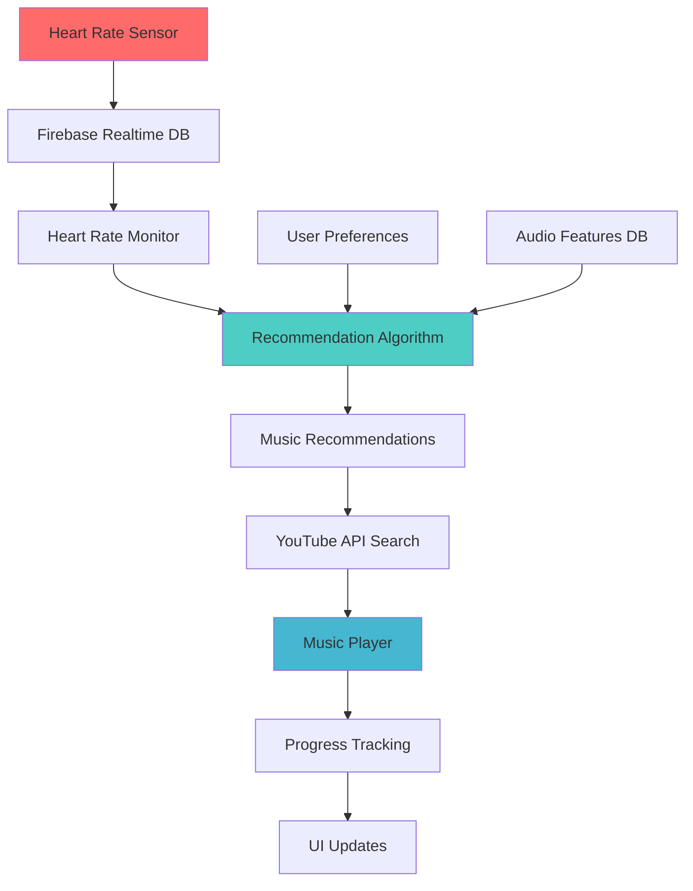

# HeartStream - Heart Rate-Based Music Player 🎵💓

HeartStream is an innovative music streaming application that uses real-time heart rate data to curate and play the perfect music for your current mood and activity level. Built with Svelte, Firebase, and the YouTube API, it creates a personalized listening experience that adapts to your physiological state.

## ✨ Features

### 🫀 Heart Rate Integration
- **Real-time BPM monitoring** through connected heart rate sensors
- **Dynamic music matching** based on current heart rate
- **Adaptive tempo selection** that syncs with your cardiovascular rhythm

### 🎯 Advanced Music Recommendation
- **Hybrid recommendation algorithm** combining:
  - BPM-based tempo matching
  - Audio feature analysis (energy, danceability, valence, etc.)
  - User preference weighting
  - Multi-dimensional Euclidean distance calculations
- **Smart song disambiguation** for tracks with multiple artists
- **Infinite playlist generation** with seamless playback

### 👤 Personalized Experience
- **User preference profiling**:
  - Energy level preferences (0-1 scale)
  - Music popularity preferences (chart-toppers vs. hidden gems)
  - Danceability rating (1-5 scale)
  - Speechiness preferences (instrumental vs. lyric-focused)
- **Google Authentication** with persistent user profiles
- **Firebase integration** for user data and preferences storage

### 🎮 Intuitive Interface
- **Modern glassmorphism design** with smooth animations
- **Real-time progress tracking** with visual progress bars
- **Dynamic play/pause controls** that adapt to player state
- **ECG-style visualization** with animated heart rate display
- **Mobile-optimized** responsive design (433px width)

### 🎵 Music Playback
- **YouTube integration** for unlimited music access
- **Lazy loading** - only searches for videos when songs are played
- **Error handling** with automatic fallback to next track
- **Queue management** maintaining 11 songs ahead automatically

## 🚀 Getting Started

### Prerequisites
- Node.js (v16 or higher)
- npm or yarn
- Firebase project with Realtime Database
- YouTube Data API v3 key
- Heart rate sensor (optional for full functionality)

### Installation

1. **Clone the repository**
   ```bash
   git clone <repository-url>
   cd HeartRate-MusicPlayer
   ```

2. **Install dependencies**
   ```bash
   npm install
   ```

3. **Set up Firebase configuration**
   - Create a Firebase project at [Firebase Console](https://console.firebase.google.com/)
   - Enable Authentication and Realtime Database
   - Add your Firebase config to `src/lib/firebase.ts`

4. **Configure YouTube API**
   - Get YouTube Data API v3 key from [Google Cloud Console](https://console.cloud.google.com/)
   - Add your API key to `src/lib/youtube-api.ts`

5. **Set up the database**
   - Import audio features data to Firebase Realtime Database
   - Structure: `/audioFeatures/{trackId}` containing Spotify audio feature data

6. **Start the development server**
   ```bash
   npm run dev
   ```

## 🏗️ Architecture

### Technology Stack
- **Frontend**: Svelte + TypeScript + Vite
- **Backend**: Firebase (Authentication + Realtime Database)
- **Music API**: YouTube Data API v3
- **Styling**: Custom CSS with CSS custom properties

### Key Components

```
src/
├── App.svelte              # Main application component
├── lib/
│   ├── firebase.ts         # Firebase configuration
│   └── youtube-api.ts      # YouTube API integration
├── app.css                 # Global styles and design system
└── assets/                 # Static assets (logos, images)
```

### Data Flow



## 🎛️ User Journey

1. **Launch Screen** - HeartStream logo animation (3s)
2. **Welcome Page** - Introduction and continue button
3. **Authentication** - Google sign-in integration
4. **Preferences Setup** - Music taste configuration (first-time users)
5. **Sensor Connection** - Heart rate sensor pairing
6. **Home Dashboard** - Heart rate display and music search
7. **Music Discovery** - Search and recommendation interface
8. **Playback Control** - Full-featured music player


## 🧮 Recommendation Algorithm

The core recommendation system uses a **hybrid distance algorithm** that considers:

### Audio Feature Analysis
- **Danceability**: How suitable a track is for dancing
- **Energy**: Perceptual measure of intensity and activity
- **Valence**: Musical positiveness conveyed by a track
- **Instrumentalness**: Predicts whether a track contains vocals
- **Liveness**: Detects presence of audience in recording

### Heart Rate Integration
```javascript
function hybridDistance(candidate, base, userPreferences) {
  // Calculate audio feature distance
  let audioDistance = euclideanDistance(candidate, base, userPreferences);
  
  // Add BPM weighting based on current heart rate
  let bpmWeight = Math.min(currentBPM / 200, 1);
  let bpmDistance = bpmWeight * Math.abs(candidate.tempo - currentBPM);
  
  return Math.sqrt(audioDistance² + bpmDistance²);
}
```

## 🔧 Configuration

### Firebase Setup
```javascript
// src/lib/firebase.ts
const firebaseConfig = {
  apiKey: "your-api-key",
  authDomain: "your-domain.firebaseapp.com",
  databaseURL: "https://your-db.firebasedatabase.app/",
  projectId: "your-project-id"
};
```

### Database Structure
```
{
  "heart_rate": {
    "current_bpm": 75,
    "last_updated": 1640995200000
  },
  "audioFeatures": {
    "track_id_1": {
      "track_name": "Song Title",
      "artist_name": "Artist Name",
      "tempo": 120,
      "energy": 0.8,
      "danceability": 0.7,
      // ... other Spotify audio features
    }
  },
  "users": {
    "user_id": {
      "preferences": {
        "energy": 0.5,
        "popularity": "hidden-gems",
        "danceability": 3,
        "speechiness": 3
      }
    }
  }
}
```


## 🙏 Acknowledgments

- **Spotify Web API** for audio feature data structure
- **YouTube API** for music streaming capabilities
- **Firebase** for real-time database and authentication
- **Svelte** for the reactive UI framework

## 📞 Support

For questions, issues, or feature requests, please:
- Open an issue on GitHub
- Check existing documentation
- Review the troubleshooting guide

---

**HeartStream** - *Music that moves with your heartbeat* 💓🎵