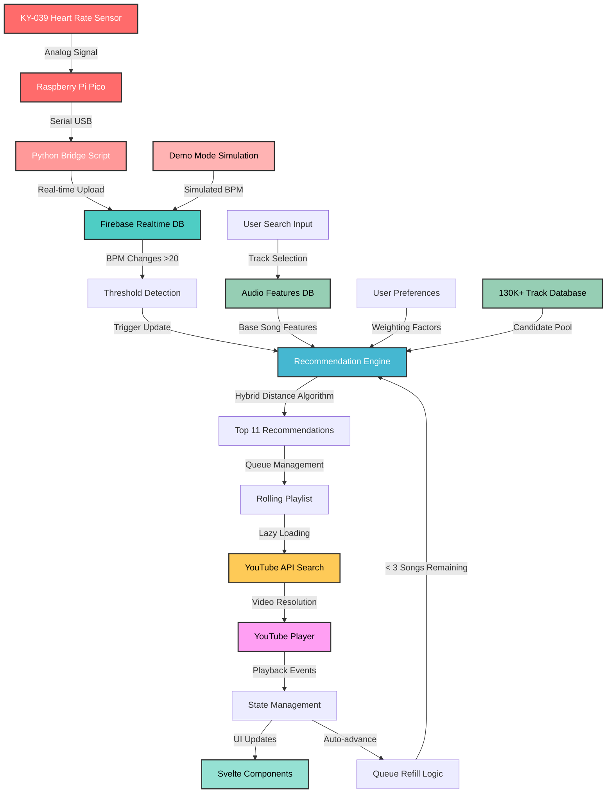

# HeartStream - Heart Rate-Based Music Player 🎵💓

HeartStream is an innovative music streaming application that uses real-time heart rate data to curate and play the perfect music for your current mood and activity level. Built with Svelte, Firebase, and the YouTube API, it creates a personalized listening experience that adapts to your physiological state.

## ✨ Features

### 🫀 Heart Rate Integration
- **Real-time BPM monitoring** through connected heart rate sensors
- **Dynamic music matching** based on current heart rate
- **Adaptive tempo selection** that syncs with your cardiovascular rhythm
- **Threshold-based playlist updates** (>20 BPM change triggers new recommendations)

### 🎯 Advanced Music Recommendation
- **Hybrid recommendation algorithm** combining:
  - BPM-based tempo matching
  - Audio feature analysis (energy, danceability, valence, etc.)
  - User preference weighting
  - Multi-dimensional Euclidean distance calculations
- **Smart song disambiguation** for tracks with multiple artists
- **Infinite playlist generation** with seamless playback
- **Intelligent queue management** maintaining 11 songs ahead automatically

### 👤 Personalized Experience
- **User preference profiling**:
  - Energy level preferences (0-1 scale)
  - Music popularity preferences (chart-toppers vs. hidden gems)
  - Danceability rating (1-5 scale)
  - Speechiness preferences (instrumental vs. lyric-focused)
- **Google Authentication** with persistent user profiles
- **Firebase integration** for user data and preferences storage

### 🎵 Music Playback
- **YouTube integration** for unlimited music access
- **Lazy loading** - only searches for videos when songs are played
- **Error handling** with automatic fallback to next track
- **Smart playback controls** that adapt to player state

### 🎭 Demo Mode

#### 🏃‍♂️ Automated Workout Simulation

The demo mode simulates a realistic workout with **6 phases** over approximately **100 seconds**:

1. **Warm-up** (60 → 90 BPM, 15s) - Gentle heart rate increase
2. **Light Exercise** (90 → 120 BPM, 20s) - Moderate activity
3. **High Intensity** (120 → 170 BPM, 15s) - Intense workout phase
4. **Cool Down** (170 → 130 BPM, 15s) - Beginning recovery
5. **Recovery** (130 → 80 BPM, 20s) - Active recovery
6. **Rest** (80 → 65 BPM, 15s) - Return to baseline


## 🏗️ Architecture

### Technology Stack
- **Frontend**: Svelte + TypeScript + Vite
- **Backend**: Firebase (Authentication + Realtime Database)
- **Hardware Bridge**: Python script for Pico-to-Firebase communication
- **Music API**: YouTube Data API v3
- **Hardware**: Raspberry Pi Pico + KY-039 Heart Rate Sensor
- **Styling**: Custom CSS with organized design system

### Key Components

```
src/
├── App.svelte              # UI components and presentation layer
├── AppLogic.ts             # Logic, state management, and API integrations
├── lib/
│   ├── firebase.ts         # Firebase configuration
│   └── youtube-api.ts      # YouTube API integration
├── app.css                 # Global styles and design system
└── assets/                 # Static assets (logos, images)

hardware/
├── main.py                           # MicroPython script for Raspberry Pi Pico
└── computer_firebase_bridge.py       # Python serial-to-Firebase bridge
```

## 🔗 API Integrations

### Firebase Realtime Database
- **Real-time BPM monitoring** with threshold-based playlist updates
- **User preferences storage** with persistent profiles across sessions
- **130,000+ track database** with Spotify-compatible audio features

### YouTube Data API v3
- **Video Resolution**: Only searches for YouTube videos when user plays a song (lazy loading)
- **Performance benefit**: Avoids unnecessary API calls, saves daily quotas
- **Smart fallback**: "Track Artist Official" → "Track Artist" → Skip to next

## 🔌 Hardware Integration

### 💡 Components Used

| Component | Description |
|-----------|-------------|
| **Raspberry Pi Pico** | Microcontroller that runs MicroPython and reads sensor data |
| **KY-039 Heartbeat Sensor** | Optical pulse sensor that detects heart rate through fingertip reflectivity |
| **Python Bridge Script** | Receives serial data from Pico and uploads to Firebase Realtime Database |
| **USB Cable** | Powers the Pico and enables serial communication with the host machine |

### 🧠 Functionality Overview

**Heartbeat Detection**
- KY-039 sensor uses infrared LED and photodiode to detect blood volume changes through fingertip

**BPM Calculation**
- MicroPython script processes analog readings with peak detection and noise filtering

**Serial Communication**
- BPM values transmitted via USB to Python bridge script with error handling

**Python Bridge Script**
- Receives serial data from Pico and uploads real-time BPM to Firebase Realtime Database

**Firebase Integration**
- Web application listens to Firebase for real-time heart rate updates and triggers music adaptation

### 🔄 Hardware Data Flow

```
KY-039 Sensor → Analog Signal → Raspberry Pi Pico → MicroPython Processing
      ↓
  BPM Calculation → Serial USB → Python Bridge Script → Firebase Upload
      ↓
Firebase Realtime DB → Web App Listener → Threshold Detection → Music Adaptation
```

## 📊 Complete Data Flow

### System Architecture Overview


## 🔄 Continuous Recommendation System

### Queue Management
HeartStream maintains a **rolling queue of 11 songs** that automatically refills as songs are played.

```typescript
// Automatic refill when < 3 songs remaining
async function maybeLoadMoreRecommendations() {
  if (currentIndex >= recommendations.length - 3) {
    const moreRecs = await getMoreRecommendations();
    recommendations.update(current => [...current, ...moreRecs]);
  }
}
```

### Threshold-Based Updates
**20 BPM threshold** triggers complete playlist regeneration to balance responsiveness with stability.

```typescript
function checkAndUpdatePlaylistForBPM(newBpm: number) {
  if (!lastRecommendationBpm || 
      Math.abs(newBpm - lastRecommendationBpm) >= 20) {
    
    lastRecommendationBpm = newBpm;
    buildRecommendations(); // Regenerate entire playlist
  }
}
```

### Multi-Stage Pipeline
1. **Base Song Analysis** - Extract audio features from user's selection
2. **Feature Matching** - Calculate hybrid distance across 130K+ tracks
3. **Popularity Weighting** - Apply user preference multipliers  
4. **Final Ranking** - Select top 11 recommendations

```typescript
// Hybrid distance algorithm combining audio features + heart rate
function hybridDistance(candidate: AudioFeature, base: AudioFeature): number {
  const energyDiff = Math.abs(candidate.energy - base.energy);
  const danceabilityDiff = Math.abs(candidate.danceability - base.danceability);
  
  // Heart rate influence on tempo matching
  const currentBPM = get(currentBpm) || 75;
  const bpmDistance = Math.abs(candidate.tempo - currentBPM) / 200;
  
  return Math.sqrt(energyDiff² + danceabilityDiff² + bpmDistance²);
}
```

### Real-Time Adaptation
- **Seamless playback** with auto-advance and lazy video loading
- **State synchronization** between heart rate changes and music updates
- **Demo mode integration** uses same pipeline as real sensor data

```typescript
// Auto-advance logic ensures continuous playback
function onPlayerStateChange(event: YT.OnStateChangeEvent) {
  if (event.data === YT.PlayerState.ENDED) {
    skipToNext();
    maybeLoadMoreRecommendations(); // Keep queue full
  }
}
```

## 🔄 Configuration

### Firebase Setup
```typescript
// src/AppLogic.ts
const firebaseConfig = {
  apiKey: "your-api-key",
  authDomain: "your-domain.firebaseapp.com",
  databaseURL: "https://your-db.firebasedatabase.app/",
  projectId: "your-project-id"
};
```
### Database Structure
```
{
  "heart_rate": {
    "current_bpm": 75,
    "last_updated": 1640995200000
  },
  "audioFeatures": {
    "track_id_1": {
      "track_name": "Song Title",
      "artist_name": "Artist Name",
      "tempo": 120,
      "energy": 0.8,
      "danceability": 0.7,
      // ... other Spotify audio features
    }
  },
  "users": {
    "user_id": {
      "preferences": {
        "energy": 0.5,
        "popularity": "hidden-gems",
        "danceability": 3,
        "speechiness": 3
      }
    }
  }
}
```


## 🔍 Challenges

### 🔌 Hardware Integration Challenges

**Signal Processing & Noise Filtering**
- **Challenge**: KY-039 sensor readings are sensitive to movement, ambient light, and finger pressure
- **Solution**: Implemented peak detection algorithms and moving averages to filter noise and extract stable BPM readings

### 🎵 Music Recommendation Challenges

**Large Dataset Search Performance**
- **Challenge**: Searching 130,000+ tracks in real-time without UI lag
- **Solution**: Pre-indexed audio features by track name/artist with optimized distance calculations

**Multi-Dimensional Feature Matching**
- **Challenge**: Balancing heart rate influence with user preferences and audio features
- **Solution**: Hybrid distance algorithm with weighted euclidean distance and BPM normalization


## 🙏 Acknowledgments

- **Spotify Web API** for audio feature data structure
- **YouTube API** for music streaming capabilities
- **Firebase** for real-time database and authentication
- **Svelte** for the reactive UI framework


---

**HeartStream** - *Music that moves with your heartbeat* 💓🎵
