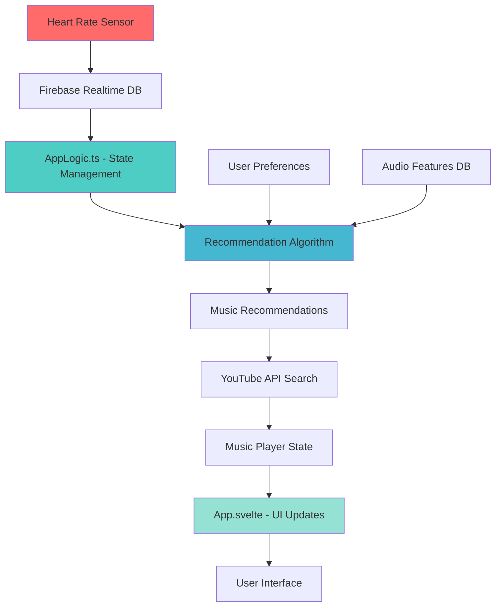

# HeartStream - Heart Rate-Based Music Player 🎵💓

HeartStream is an innovative music streaming application that uses real-time heart rate data to curate and play the perfect music for your current mood and activity level. Built with Svelte, Firebase, and the YouTube API, it creates a personalized listening experience that adapts to your physiological state.

## ✨ Features

### 🫀 Heart Rate Integration
- **Real-time BPM monitoring** through connected heart rate sensors
- **Dynamic music matching** based on current heart rate
- **Adaptive tempo selection** that syncs with your cardiovascular rhythm

### 🎯 Advanced Music Recommendation
- **Hybrid recommendation algorithm** combining:
  - BPM-based tempo matching
  - Audio feature analysis (energy, danceability, valence, etc.)
  - User preference weighting
  - Multi-dimensional Euclidean distance calculations
- **Smart song disambiguation** for tracks with multiple artists
- **Infinite playlist generation** with seamless playback
- **Intelligent queue management** maintaining 11 songs ahead automatically

### 👤 Personalized Experience
- **User preference profiling**:
  - Energy level preferences (0-1 scale)
  - Music popularity preferences (chart-toppers vs. hidden gems)
  - Danceability rating (1-5 scale)
  - Speechiness preferences (instrumental vs. lyric-focused)
- **Google Authentication** with persistent user profiles
- **Firebase integration** for user data and preferences storage

### 🎵 Music Playback
- **YouTube integration** for unlimited music access
- **Lazy loading** - only searches for videos when songs are played
- **Error handling** with automatic fallback to next track
- **Smart playback controls** that adapt to player state


## 🏗️ Architecture

### Technology Stack
- **Frontend**: Svelte + TypeScript + Vite
- **Backend**: Firebase (Authentication + Realtime Database)
- **Music API**: YouTube Data API v3
- **Styling**: Custom CSS with organized design system

### Key Components

```
src/
├── App.svelte              # UI components and presentation layer
├── AppLogic.ts             # Logic, state management, and API integrations
├── lib/
│   ├── firebase.ts         # Firebase configuration
│   └── youtube-api.ts      # YouTube API integration
├── app.css                 # Global styles and design system
└── assets/                 # Static assets (logos, images)
```


### Data Flow



## 🎛️ User Journey

1. **Launch Screen** - HeartStream logo animation (3s)
2. **Welcome Page** - Introduction and continue button
3. **Authentication** - Google sign-in integration
4. **Preferences Setup** - Music taste configuration (first-time users)
5. **Instructions Page** - Clear explanation of how HeartStream works
5. **Sensor Connection** - Heart rate sensor pairing
6. **Home Dashboard** - Heart rate display and music search
8. **Music Discovery** - Advanced search and recommendation interface
9. **Playback Control** - Full-featured music player with progress tracking


## 🧮 Recommendation Algorithm

The core recommendation system uses a **hybrid distance algorithm** that considers:

### Audio Feature Analysis
- **Danceability**: How suitable a track is for dancing
- **Energy**: Perceptual measure of intensity and activity
- **Valence**: Musical positiveness conveyed by a track
- **Instrumentalness**: Predicts whether a track contains vocals
- **Liveness**: Detects presence of audience in recording

### Heart Rate Integration
```typescript
function hybridDistance(candidate: AudioFeature, base: AudioFeature, userPreferences: UserPreferences): number {
  // Calculate audio feature distance with user preference weighting
  let audioDistance = euclideanDistance(candidate, base, userPreferences);
  
  // Add BPM weighting based on current heart rate
  let bpmWeight = Math.min(currentBPM / 200, 1);
  let bpmDistance = bpmWeight * Math.abs(candidate.tempo - currentBPM);
  
  return Math.sqrt(audioDistance² + bpmDistance²);
}
```

## 🔧 Configuration

### Firebase Setup
```typescript
// src/AppLogic.ts
const firebaseConfig = {
  apiKey: "your-api-key",
  authDomain: "your-domain.firebaseapp.com",
  databaseURL: "https://your-db.firebasedatabase.app/",
  projectId: "your-project-id"
};
```

### Database Structure
```
{
  "heart_rate": {
    "current_bpm": 75,
    "last_updated": 1640995200000
  },
  "audioFeatures": {
    "track_id_1": {
      "track_name": "Song Title",
      "artist_name": "Artist Name",
      "tempo": 120,
      "energy": 0.8,
      "danceability": 0.7,
      // ... other Spotify audio features
    }
  },
  "users": {
    "user_id": {
      "preferences": {
        "energy": 0.5,
        "popularity": "hidden-gems",
        "danceability": 3,
        "speechiness": 3
      }
    }
  }
}
```


## 🔍 Challenges
여기에 각 부분에 대한 챌린지 적어두기


## 🙏 Acknowledgments

- **Spotify Web API** for audio feature data structure
- **YouTube API** for music streaming capabilities
- **Firebase** for real-time database and authentication
- **Svelte** for the reactive UI framework


---

**HeartStream** - *Music that moves with your heartbeat* 💓🎵